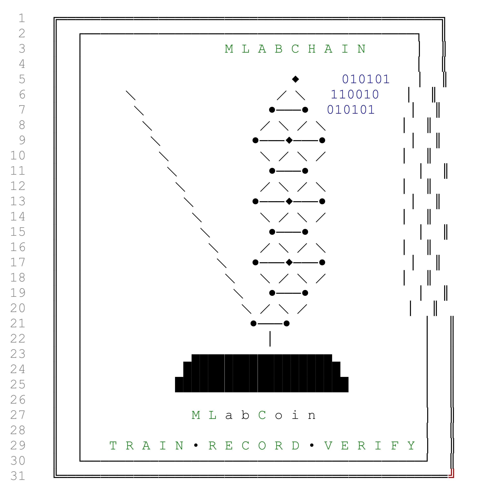

  

---

# MLabChain

## 1. Overview

MLabChain is a local, single-file, single-writer ledger for machine-learning experiments. It records training runs as signed transactions, each carrying the SHA-256 of the resulting model, the hash of the architecture description, the training-set size, the reported wall time in seconds, the validation and test errors, and a bounded scientific-work score derived from all of these. Transactions are sealed into a Proof-of-Work chain stored as a JSON file, in the same style as the LabChain and HEPLabChain tools.

The novelty, such as it is, is not the blockchain. The chain, the Merkle tree, the RSA signatures, and the hash-based block sealing are all standard, and the project does not claim otherwise. What is specific to MLabChain is the accounting layer: a documented definition of *scientific computational work* that can be recorded, audited by re-execution, and compared across runs on different hardware, without appealing to FLOPS, GPU-hours, or any other hardware-specific quantity.

The project runs on a laptop, requires only `cryptography` beyond the standard library, and produces a record that a reader can inspect with `cat` and a verifier can re-derive with `python mlabchain.py verify-ml`.

## 2. Motivation

Machine-learning experiments have a provenance problem that is structurally similar to the one HEPLabChain addresses for physics analyses. A trained model is a binary artifact. The configuration that produced it, the dataset it was trained on, and the metric it achieved are all recorded — if at all — in scattered notebooks, ad-hoc CSV logs, or the analyst's memory. Six months later, nobody can say which config produced which checkpoint, or whether the model that is currently deployed is the one that was validated.

Existing MLOps tooling addresses parts of this — model registries, experiment trackers, metadata stores — but assumes a server, an account, and a network. For a single analyst working on a personal machine, that is often more infrastructure than the problem warrants.

MLabChain takes the opposite approach. It is a personal receipt, local, tamper-evident, and self-contained. The analyst registers a training run, gets back a signed transaction, and can later prove that the model on disk has not changed since. If they want to check that the metrics were honestly reported, they re-train and compare. The chain provides immutability; the re-training provides verification. Both are needed, and neither alone is sufficient.

## 3. Scope and non-goals

**In scope.**

- Recording a training run: config, model hash, architecture description, training metadata, metrics.
- Computing a bounded, hardware-agnostic scientific-work score (LSWU) from those quantities.
- Computing a symbolic operation count for the training loop, so the work is expressed in elementary floating-point operations as well as seconds.
- Sealing transactions into a local Proof-of-Work chain with cryptographic signatures.
- Verifying a recorded run by re-executing it and comparing metrics, LSWU components, symbolic cost, and wall time.
- Pinning the scientific task via a challenge manifest, so different runs are comparable.

**Out of scope, explicitly.**

- Being a tradeable coin, a token, a network, or a consensus system. There is no peer set, no fork choice, no global agreement, no exchange, no liquidity, and no economic mechanism.
- Claiming that verification is cheap. It is not. Verification re-executes training. This is stated in the code, in the CLI output, and throughout this document.
- Claiming that training is verifiable in general. Real ML training is non-deterministic. The trainer implemented here is deterministic on purpose, and the docstring says so.
- Replacing MLOps tooling. It is smaller in ambition and different in kind: a personal ledger, not a platform.
- Supporting arbitrary model classes. Only a pure-Python linear-regression SGD loop is implemented, because only that loop admits a defensible symbolic cost formula.

## 4. Design principles

**Traceable accounting.** Every number the tool records is either an observed measurement (wall time), a cryptographic hash (model bytes), or a value computed from a documented formula (LSWU, symbolic ops). Nothing is asserted without a derivation.

**Challenge-relative scoring.** A quality score is meaningless without a fixed task. The LSWU quality term is computed relative to a baseline NMSE that is pinned by a challenge manifest, not chosen by the contributor. Without a pinned baseline, the quality term is a signed claim.

**Determinism for verification.** The trainer is deterministic given the config and the challenge. This is not because determinism is realistic for ML, but because it makes re-execution a meaningful audit. The code marks the assumption and warns when it is violated.

**Bounded rewards.** The LSWU formula is bounded above and below across the plausible input space. There is no way to obtain an arbitrarily large score by reporting a tiny NMSE, and no way to obtain an arbitrarily small score by reporting a large one. The formula's dynamic range is documented.

**Claims versus measurements.** Local artifacts are hashed by the tool. Reported wall times are signed by the contributor and are claims, not measurements. The distinction is marked in the transaction, in the CLI output, and in this document.

## 5. The scientific work unit

The central object of the project is the **MLabChain Scientific Work Unit (LSWU)**, a bounded score that combines three normalized quantities.

**Dataset term.** With $N$ the number of training examples and $N_0 = 10^5$ a reference size,

$$
D(N) = \ln\left(1 + \frac{N}{N_0}\right).
$$

The logarithm is deliberate. Going from $10^5$ to $10^6$ examples should count for more work; going from $10^8$ to $10^9$ should not count for ten times more. The log term gives diminishing returns on both ends, which is what discourages inflating dataset size for reward.

**Time term.** With $t$ the reported training wall time in seconds and $t_0 = 60$ s a reference,

$$
T(t) = \ln\left(1 + \frac{t}{t_0}\right).
$$

The logarithm here does two things. It gives more credit to a long training run than to a short one, but not proportionally, so a machine that is six times slower does not receive six times the reward. And it dampens the incentive to pad wall time artificially, because doubling the reported time does not double the score.

**Quality term.** With $\mathrm{NMSE}_\text{model}$ the model's normalized mean squared error on the test split and $\mathrm{NMSE}_\text{baseline}$ the baseline's,

$$
I = \frac{\mathrm{NMSE}_\text{baseline}}{\mathrm{NMSE}_\text{model}}, \qquad
Q(I) = \frac{I^\eta}{1 + I^\eta}.
$$

The ratio $I$ is bounded below by $0$ and above by the model's improvement over the baseline. The function $Q$ is bounded in $(0, 1)$ and saturates as the model beats the baseline by a large margin, which prevents a reward explosion from a lucky run. With $\eta = 2$, a model that halves the baseline's error scores $Q = 0.8$, and a model that improves by a factor of ten scores $Q \approx 0.99$.

**The score.**

$$
\mathrm{LSWU} = D(N)^{w_N} \cdot T(t)^{w_t} \cdot Q(I)^{w_Q}
$$

with defaults

$$
w_N = 0.15, \qquad w_t = 0.30, \qquad w_Q = 1.00, \qquad \eta = 2.
$$

The exponents do not sum to one. This is a deliberate departure from the geometric-mean interpretation that $w_N + w_t + w_Q = 1$ would give. With that constraint, the dynamic range of the score across the plausible input space is roughly $5\times$, which makes the score a poor discriminator. With the exponents above, the range is closer to $12\times$, dominated by the quality term. The intent is that quality dominates the ordering, time comes second, and dataset size third; the exponents are chosen to produce that ordering and are documented in the code.

The dynamic range of each factor, across the plausible input space, is:

| Term | Range | Contribution |
|---|---|---|
| $D(N)$ | $N \in [10^5, 10^9]$ | $1.60\times$ |
| $T(t)$ | $t \in [60, 3.6 \times 10^5]$ s | $1.90\times$ |
| $Q(I)$ | $I \in [1, 100]$ | $3.94\times$ |
| **Total** | | $\approx 12\times$ |

## 6. Symbolic cost accounting

The LSWU is a scientific-work score. It is not the same as a count of operations. Both are recorded, because they answer different questions.

For the linear-regression SGD loop implemented here, the per-sample, per-epoch cost is derived directly from the loop body:

- forward pass: $F$ multiplies and $F$ adds for the dot product, plus one bias addition → $F + 1$ operations
- residual: one subtraction → $1$ operation
- weight update: $F$ multiplies and $F$ subtractions → $2F$ operations
- bias update: one multiply-add plus one subtraction → $2$ operations

Summing:

$$
\kappa(F) = (F + 1) + 1 + 2F + 2 = 3F + 4.
$$

The full symbolic cost of a training run is

$$
C_\text{train} = E \cdot N_\text{tr} \cdot (3F + 4)
$$

where $E$ is the number of epochs and $N_\text{tr}$ is the number of training examples. Because verification re-executes the training rather than checking a hash, the verification cost is the same number:

$$
C_\text{verify} = C_\text{train}.
$$

This equality is not an accident of implementation. It is the defining property of Proof-of-Scientific-Work. The tool reports both numbers and states the equality explicitly in the verification output.

## 7. The cost relation, stated formally

Let $c$ and $c'$ be the cost of one elementary operation on the mining and verifying machines respectively. Then the wall-clock training and verification times are

$$
T_\text{train} = c \, E \, N_\text{tr} \, (3F + 4) + \varepsilon_\text{train},
$$

$$
T_\text{verify} = c' \, E \, N_\text{tr} \, (3F + 4) + \varepsilon_\text{verify},
$$

where $\varepsilon$ collects everything not in the inner loop. Ignoring overheads, the asymmetry factor is

$$
\rho = \frac{T_\text{verify}}{T_\text{train}} \approx \frac{c'}{c}.
$$

For comparison, Bitcoin's asymmetry is $\rho_\text{BTC} = 2^d$, which with the current difficulty is roughly $10^6$. MLabChain's is approximately $1$. The difference is not a defect in MLabChain. It is a consequence of what "useful work" means: the moment the work has external value, verifying it requires redoing it.

This is the wall that every "useful proof-of-work" scheme hits, and it is why MLabChain is framed as a provenance ledger rather than a security mechanism. The tool reports the ratio $\rho$ on every verification, so the user sees the property directly rather than reading about it in a whitepaper.

## 8. Challenge manifests

A training run is meaningful only relative to a fixed task. MLabChain represents the task as a **challenge manifest**, a JSON document that pins:

- the dataset, by SHA-256 of its committed values,
- the number of examples and features,
- the generator seed and noise level (for synthetic datasets),
- the split rule and train fraction,
- the metric,
- the baseline kind and the baseline NMSE,
- the LSWU parameters ($N_0$, $t_0$, $\eta$, $w_N$, $w_t$, $w_Q$).

The manifest is written to disk with a self-hash, `manifest_sha256`, computed over its canonical form. `load_challenge` verifies this hash, so a modified manifest is detected before it is used. Every training transaction commits to the manifest hash and to the individual pinned fields, so a verifier can reconstruct the challenge without the original file.

Pinning the baseline is the single most important design choice in the manifest. If the contributor chooses the baseline, the quality term is a signed claim rather than a measurement. With the baseline pinned by the challenge, the contributor cannot pick a weak reference to inflate their score, and a verifier can recompute the ratio from the model's actual test performance.

The current implementation supports one baseline kind, `mean_predictor`, whose NMSE on the test split is exactly $1.0$ by construction. This makes the ratio $I$ equal to $1 / \mathrm{NMSE}_\text{model}$, which is easy to interpret. Pinning a trained baseline is supported by the data model but not yet exercised by the trainer.

The current implementation also supports one split rule, `first_fraction`. Any other rule would need to be added explicitly, and the important property is that the rule is *named* in the manifest, so a verifier can reproduce it exactly.

## 9. Verification semantics

`verify-ml` is the tool's audit path. It takes a model file or a transaction hash, locates the matching transaction, reconstructs the challenge from the transaction's committed fields, re-trains from the recorded config, and compares:

- **metrics** — MSE on train and test, NMSE model and baseline, $R^2$ on test,
- **LSWU components** — each of $D$, $T$, $Q$ raised to its exponent, and the product,
- **symbolic cost** — the recorded `C_train_ops` against the recomputed `C_verify_ops`,
- **wall time** — the verification time against the reported training time, and their ratio.

Because the trainer is deterministic, metric matches are exact to floating-point tolerance. In a stochastic regime, the same code would produce approximate matches and the check would need to be relaxed. The code marks this explicitly: the verification prints a note when the model bytes differ from the recorded hash even though the metrics match, which is what would happen across pickle versions or framework upgrades.

`verify-ml` is an audit tool, not a per-transaction validation tool. It cannot be run on every transaction in a live system, because it costs what the transaction cost. Its purpose is to check a specific run when the user wants to, and to make the verification cost visible when it is run.

## 10. Trust model

MLabChain assumes a single writer: the analyst who owns the data directory. It defends against:

- **Accidental modification.** A model file that has drifted since it was recorded is detected by comparing its SHA-256 against the recorded value.
- **Silent edits to the chain.** A changed block header, transaction, Merkle root, or signature causes `validate` to fail.
- **Forged transactions.** A transaction whose signature does not verify against its embedded public key is rejected.
- **Inflated reward through a weak baseline.** Prevented by pinning the baseline in the challenge manifest.
- **Inflated reward through a manipulated split.** Prevented by pinning the split rule in the manifest.
- **Inflated reward through a padded wall time.** Mitigated by the logarithmic time term, which dampens but does not eliminate the incentive to over-report.

It does not defend against:

- **An adversary with write access to `mlabchain_data/`.** Such an adversary can rewrite the entire chain, sealing new valid blocks. Validation guarantees internal consistency, not external truth.
- **A contributor who lies about wall time.** The reported time is signed by the contributor and is bounded below by the true training cost, but not above. The log term mitigates but does not eliminate this.
- **A contributor who trains a different model than the config implies.** Verification re-trains from the recorded config, so this is caught — but only if verification is run. It is not run automatically.
- **A challenge authority that is dishonest.** The manifest pins the task; if the authority that issues the manifest is itself an adversary, no amount of cryptographic machinery helps.

The last point is the reason MLabChain cannot be a currency. A currency whose unit of account is defined by a committee is not a currency. It is a reputation system, and that is what MLabChain is: a local, personal, tamper-evident record of scientific work, whose value is professional rather than financial.

## 11. Storage format

The chain lives in `mlabchain_data/blockchain.json` as a single JSON object with top-level fields `difficulty`, `merkle_scheme`, `schema_version`, `chain`, and `pending_transactions`. Each block is a JSON object with the header fields, the transaction list, and the stored block hash.

The wallet lives in `mlabchain_data/wallet.json` and contains the address, the private key in PKCS#8 PEM, and the public key in SubjectPublicKeyInfo PEM. The private key is stored unencrypted, and both the README and the `create-wallet` output state this plainly.

Models and architecture descriptions produced by the CLI are written to `mlabchain_data/models/` by default. Demo artifacts go to `mlabchain_data/demo/`. Challenge manifests go to `mlabchain_data/challenges/`.

Everything is human-readable JSON. There is no binary format and no compression.

## 12. Relation to existing tools

**MLflow, Weights & Biases, Neptune.** Experiment trackers. Assumes a server, records metrics and artifacts, but does not produce a tamper-evident record and does not attempt to audit training by re-execution. MLabChain is smaller and orthogonal.

**DVC, git-annex, Datalad.** Track data and model files by hash. Overlapping in spirit, but do not record the training configuration, metrics, or the LSWU. MLabChain references hashes in the same way but adds a signed transaction layer.

**Sigstore, SLSA, in-toto.** Supply-chain provenance for software. Conceptually adjacent — signed attestations of what was built and from what — but do not address ML training or scientific-work accounting.

**Proof-of-Learning (Jia et al., 2021).** A research program on verifying that a model was trained as claimed, using the training trajectory. MLabChain does not implement this; its verification is brute-force re-execution. Proof-of-Learning is what a serious cryptographic version of the idea would look like, and it is years from production.

**zkML, ezkl, Modulus Labs.** Produce succinct proofs of ML inference. Not training, and not yet practical for real models. If the "useful work is a proof" version of Proof-of-Scientific-Work ever becomes real, it will look like this.

**Primecoin, Gridcoin, Filecoin.** Prior attempts at useful proof-of-work. All of them demonstrate the same trade-off: useful work is either unneeded (Primecoin), already volunteer-priced (Gridcoin), or under-demanded (Filecoin). MLabChain learns from those examples and does not attempt a currency.

## 13. Limitations

- **Plaintext private key.** `wallet.json` is not encrypted.
- **Single writer.** Anyone with write access to the data directory can rewrite the chain.
- **Deterministic trainer only.** The linear-regression SGD loop is deterministic on purpose, which makes re-execution an exact audit. Real training is not.
- **One model class.** Only linear regression. The symbolic cost formula $3F + 4$ is specific to that loop.
- **One baseline kind exercised.** `mean_predictor` only, though the data model supports `model`.
- **One split rule.** `first_fraction` only.
- **Synthetic datasets only.** A `"file"` dataset kind is supported by the data model but not implemented.
- **Bounded dynamic range.** The LSWU spans roughly $12\times$ across the plausible input space. This is deliberate, but it means the score is not a fine-grained ranking.
- **Wall time is a claim.** It is bounded below by the true training cost and not above. The log term mitigates this.
- **Verification cost equals computation cost.** This is the defining property of Proof-of-Scientific-Work and also the reason the scheme is not a security mechanism.
- **Challenge authority is centralized.** The manifest pins the task; whoever issues the manifest defines the task. This rules out currency and is fine for a reputation tool.
- **Not audited.** The code has been tested but not reviewed by anyone else. Do not rely on it for anything that matters.

## 14. Status

MLabChain is a working prototype and a demonstration. It implements everything described above, in a single Python file, with one required dependency. It is complete enough to record real training runs on the linear-regression trainer it implements, to compute LSWU scores from those runs, and to verify them by re-execution. It is not complete enough to record arbitrary ML experiments, and it does not attempt to be.

The project is best understood as a concrete answer to a specific question: *what would a scientific-work unit look like, if it were defined formally, bounded, hardware-agnostic, and auditable by re-execution?* The answer is in the LSWU formula and in the challenge manifest. Everything else — the chain, the Merkle tree, the RSA signatures, the JSON persistence — is the scaffolding that makes the answer usable, and it is standard.

If the tool is useful to a single analyst on a single project, it has done its job. If it serves as a starting point for a more serious discussion of what scientific-work accounting should mean, it has done more than that.
